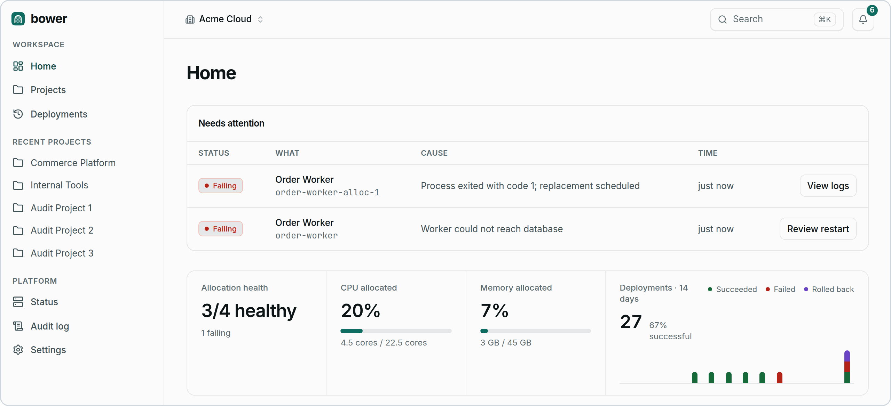

# Bower

A web dashboard for deploying and running applications on [Trellis](https://github.com/overfold/trellis).

Trellis schedules and runs containers. Bower adds the application layer on top: projects, environments, services, deployments, routes, volumes, secrets, teams, and an audit trail. Your team deploys and operates services from the dashboard, while Trellis keeps handling scheduling, placement, and the container lifecycle.

<p>
  <picture>
    <source media="(prefers-color-scheme: dark)" srcset="docs/images/dashboard-dark.png">
    
  </picture>
</p>

> [!NOTE]
> Bower hasn't reached 1.0 yet. Read the [release notes](https://github.com/overfold/bower/releases) before you update.

## Features

- **Projects and environments.** Group services and share settings. Each environment maps to its own Trellis namespace.
- **Services.** Application workloads that map to Trellis jobs and task groups.
- **Deployments.** History with plan diffs, step-by-step canary rollouts, and automatic rollback when health checks fail.
- **Managed ingress.** One shared [Caddy](https://caddyserver.com/) proxy per cluster, with automatic HTTPS. When you add a route, Bower updates the proxy and reloads it.
- **Secrets.** Stored as Trellis namespace secrets. Bower tracks metadata and rotation but never stores the values.
- **Access control.** Owner, Admin, Deployer, and Viewer roles, scoped per project.
- **Audit log.** Records every change with who made it, when, and the state before and after.
- **CI/CD hooks.** A deploy endpoint and registry webhooks, verified with HMAC signatures.

## Quick start

You need a Trellis cluster, `trellisctl` with `cluster/write` access, and a node that accepts inbound traffic on ports 80 and 443.

The manifest below targets a single-node cluster and runs Postgres alongside Bower, with data stored on that node. For production, use an external database. The [installation guide](docs/installation.md) explains how.

1. Download the manifest:

   ```bash
   curl -fsSL https://raw.githubusercontent.com/overfold/bower/main/trellis.yml -o bower.yml
   ```

2. Edit `bower.yml`. Replace the example Postgres password in both `POSTGRES_PASSWORD` and `DATABASE_URL`. For HTTPS, also set `BOWER_PUBLIC_URL` to your domain and point its DNS at the node.

3. Create the encryption key, once, and apply the manifest:

   ```bash
   openssl rand -hex 32 | trellisctl --namespace platform secrets set encryption-key --stdin
   trellisctl --namespace platform jobs apply ./bower.yml --wait
   ```

4. Find the admin invitation link in the logs, under `Bower — First Run Setup`, and open it to create the first account:

   ```bash
   trellisctl --namespace platform jobs logs bower --tail 50
   ```

Bower connects to the cluster it runs on automatically. Keep your edited `bower.yml`, because you'll apply it again to update Bower.

## Documentation

- [Installation](docs/installation.md): every deployment setting, external databases, updates, and container images
- [Configuration](docs/configuration.md): environment variables, defaults, and Trellis credentials
- [Deployment strategies](docs/deployment-strategies.md): rolling, recreate, blue-green, canary, and automatic rollback
- [Managed ingress](docs/managed-ingress.md): routes, domains, and how the Caddy proxy works
- [CI/CD automation](docs/automation.md): the deploy API and registry webhooks
- [Terminal](docs/terminal.md): the in-browser terminal and its WebSocket bridge
- [Database migrations](docs/database-migrations.md): automatic and manual migrations, and schema changes

## Contributing

Bug reports, feature requests, and questions go in [GitHub issues](https://github.com/overfold/bower/issues).

To run Bower locally and open a pull request, see [CONTRIBUTING.md](CONTRIBUTING.md). UI changes follow the [design system guide](docs/design-system/README.md).
